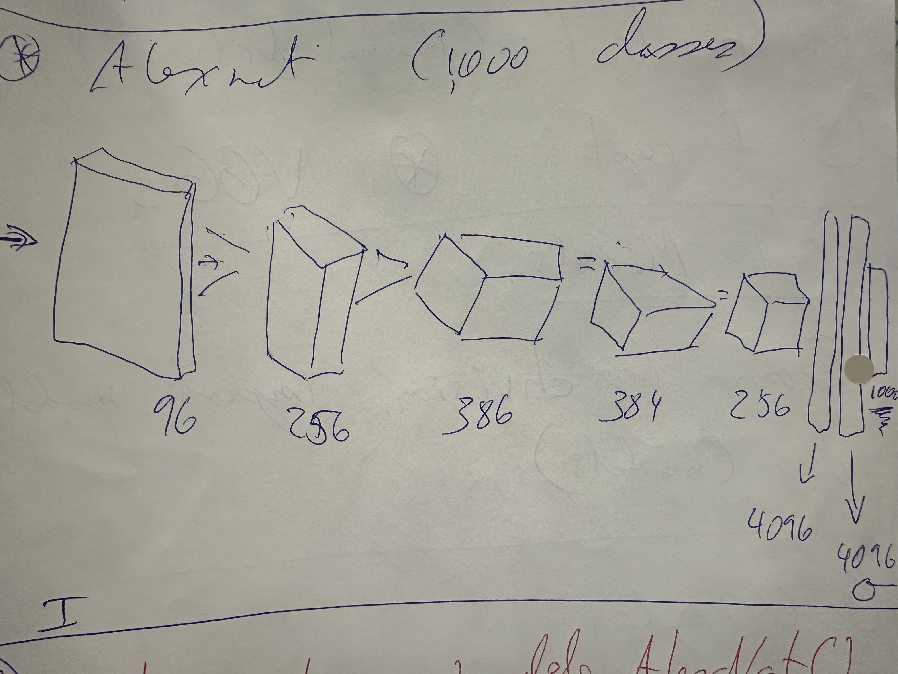

## Vision Models

* AlexNet ...won ImageNet in 2012
* ResNet (Residual Networks)
* Inception
* VGGs

## Get Models

* from torchvision import models
* dir( models )

## ResNet

* ResNet 101 -> has 101 layers

## AlexNet

* 1000 classes

* alexnet = models.AlexNet()

