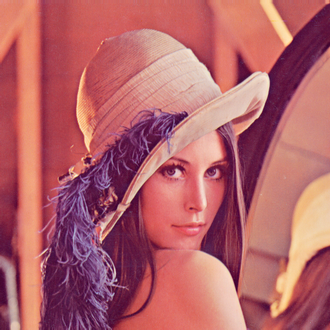

## Deep Learning algorithms

* CNNs 

## Image Processing to understand convolutions

## Filters

* Edge detection
* Blurring

## Readings

* Hao Li, Zheng Xu, Gavin Taylor, Christoph Studer, Tom Goldstein. 2018. Visualizing the Loss Landscape of Neural Nets. (https://arxiv.org/pdf/1712.09913.pdf)
* paper 
